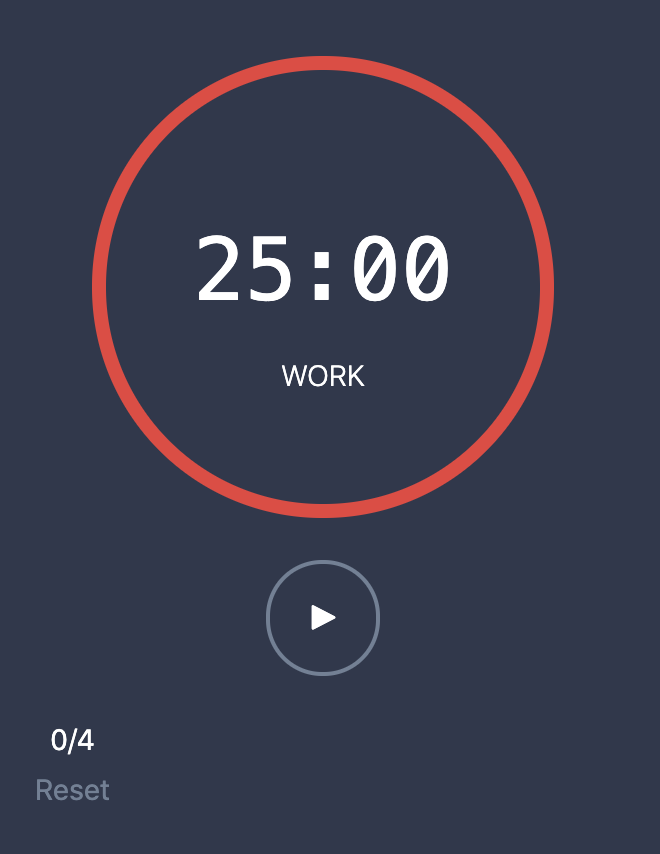

# Pomodoro Timer

An Ember application that implements a [Pomodoro Timer](https://en.wikipedia.org/wiki/Pomodoro_Technique).

## Running

- `yarn`
- `yarn start`
- visit http://localhost:4200/

### Debug Mode

Use debug mode for reduced time intervals, so you can try out the full flow much faster:

`DEBUG=true yarn start`

## Tests

`yarn test`

Included is a full end-to-end test.  Add `this.pauseTest()` anywhere within that test to play around.

## Additional User Story

The additional user story I implemented was:

> As a User, I can abandon a pomodoro after it has started

According to the Pomodoro technique, if you are interrupted during a pomodoro,
you are supposed to either record and postpone, or abondon the pomodoro and
start it over. I like the abandon approach, since it forces you to restart and
experience the full time period of uninterrupted work.

So with this feature on the app, after the pomodoro interval has started, there
is a red X button that - when clicked - resets the current pomodoro to the full
time amount.

## Time Intervals

The default time intervals are:

- Pomodoro: 25 minutes
- Break: 5 minutes
- Long Break: 25 minutes

These intervals are defined in `config/environment.js`, which are then loaded into
the model hook of `app/routes/timer.js`. As mentioned above, setting `DEBUG=true`
causes the intervals to be much shorter:

- Pomodoro: 5 seconds
- Break: 2 seconds
- Long Break: 7 seconds

In the test environment, these debug time intervals are also used. In addition,
the speed is increased significantly, so tests run very fast.

## Future Features/Improvements

- Allow the user to set their preferred intervals and total pomodoros per cycle.
These preferences could be saved on a backend service, and then loaded into the timer route
- Turn the colored circle into a progress circle
- Add more tests, especially for the components
- Use better icons for the pause and play buttons